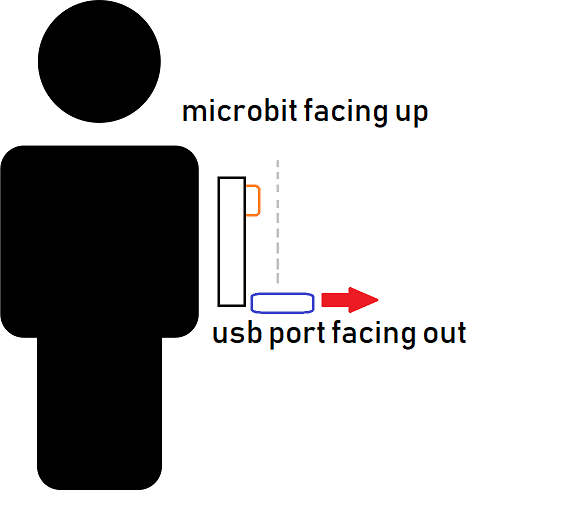

# Microbit Heart Finder

Get started with the Microbit starter pack and this neat little game!

## What it does

Using the Microbit's internal compass, find the correct location for the hidden heart by listening to the "clicks" from the buzzer while you move the microbit around.. when the clicks get fast, you're closer to the target, press the button to reveal a heart! Or a sad face if you get it wrong.

In the kit below, you will find everything you need to assemble the project.

### Bill of Materials

| Qty | Code                                     | Description               |
| --- | ---------------------------------------- | ------------------------- |
| 1   | [XC4322](https://jaycar.com.au/p/XC4322) | BBC Micro:bit Starter Kit |
| 1   | [SB2424](https://jaycar.com.au/p/SB2424) | Double pack AA Batteries  |

and that's all!

## How to Build

For complete instructions, check out our website at <https://jaycar.com.au/microbit-heart-finder/>

## How to Use

Turn on the device with the switch on the battery pack, then hold the device close to your chest, pointing downwards.

When the game begins, you will beeping corresponding to how close you are to the correct direction.

If you find the game is behaving a little oddly, chances are the device will need to be calibrated. You can find out how to do this in the instructions at <https://jaycar.com.au/microbit-heart-finder/>

## How it Works

The BBC microbit has a little compass module that tells the microbit which way it is pointing. We use that in this game to detect our direction and find where the hidden heart is. You can find more about the compass module here:

- <https://makecode.microbit.org/reference/input/compass-heading>